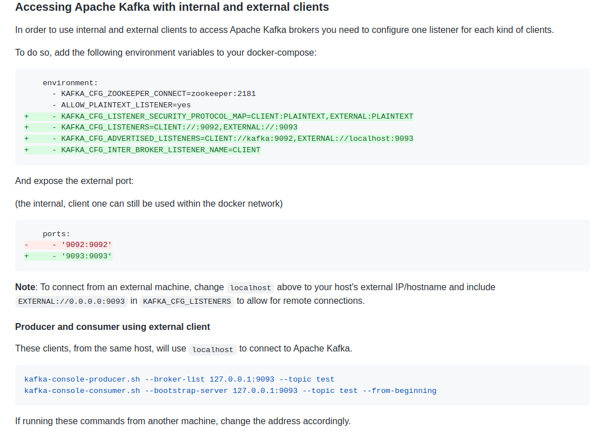
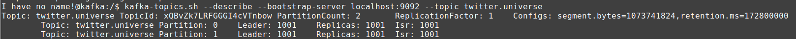

# GHG Twitter Messaging Tracker - Apache Kafka repository

## 0) Docker hub image
The bitnami/kafka image was chosen because, in June/2022, is well-maintained, the publisher is verified and has 100M+ downloads

## 1) How to Install

```
docker-compose up -d
```

## 2) How to create topics

- Access kafka service
  
    ```
    docker exec -it ghg-twitter-kafka_kafka_1 /bin/bash
    ```

- Check for kafka scripts location
    ```
    which kafka-topics.sh
    ```

- Create a new topic
    ```
    kafka-topics.sh --create --topic twitter.programming --replication-factor 1 --partitions 2 --bootstrap-server localhost:9092
    ```

## 3) How to list existing topics

- Inside docker service
    ```
    kafka-topics.sh --list --bootstrap-server=localhost:9092
    ```
## 4) How to list messages from specific topic
- Run the command below inside docker kafka service. New messages will appear as soon as producer send it
    ```
    kafka-console-consumer.sh --from-beginning --bootstrap-server localhost:9092 --topic twitter.universe
    ```


# Zookeeper

## How to list the brokers
- Access the zookeeper service
    ```
    docker exec -it ghg-twitter-kafka_zookeeper_1 /bin/bash
    ```
###
- Access the zookeeper CLI, located on folder /opt/bitnami/zookeeper/bin/zkCli.sh
    ```
    /opt/bitnami/zookeeper/bin/zkCli.sh -server localhost:2181
    ```
###
- Explore the commands below
    ```
   ls # Gives the list of all properties to explore
   ls /brokers/ids # Gives the list of active brokers
   ls /brokers/topics #Gives the list of topics
   get /brokers/ids/0 #Gives more detailed information of the broker id '0'
   ```


# Accessing apache kafka with internal and external clients

**Reminder: to use kafka with external clients, this setup on docker-compose file is necessary**
Check this documentation: https://github.com/bitnami/bitnami-docker-kafka/blob/master/README.md#accessing-apache-kafka-with-internal-and-external-clients





# Tips
## Service Hostname
To easily identify a kafka node, declare the keyword 'hostname' on kafka service. 

## Kafka client (kafkajs) firing error: Error: getaddrinfo ENOTFOUND
Check this documentation https://github.com/bitnami/bitnami-docker-kafka/blob/master/README.md#accessing-apache-kafka-with-internal-and-external-clients

It's necessary to add addtional configuration on docker-compose to kafka client works properly outside docker network

## Change the retention time for specific topic
_This is an interesting configuration for production deploy_

```
kafka-configs.sh --bootstrap-server localhost:9092 --alter --entity-type topics --entity-name twitter.universe --add-config retention.ms=172800000
```
This property changes 'twitter.universe' topic retention time to 48h or 172800000ms. **Reminder: retention.hours is a property for broker scope. To set property for topic scope, look for properties on the same scope.**

Check the new properties
```
kafka-topics.sh --describe --bootstrap-server localhost:9092 --topic twitter.universe
```
